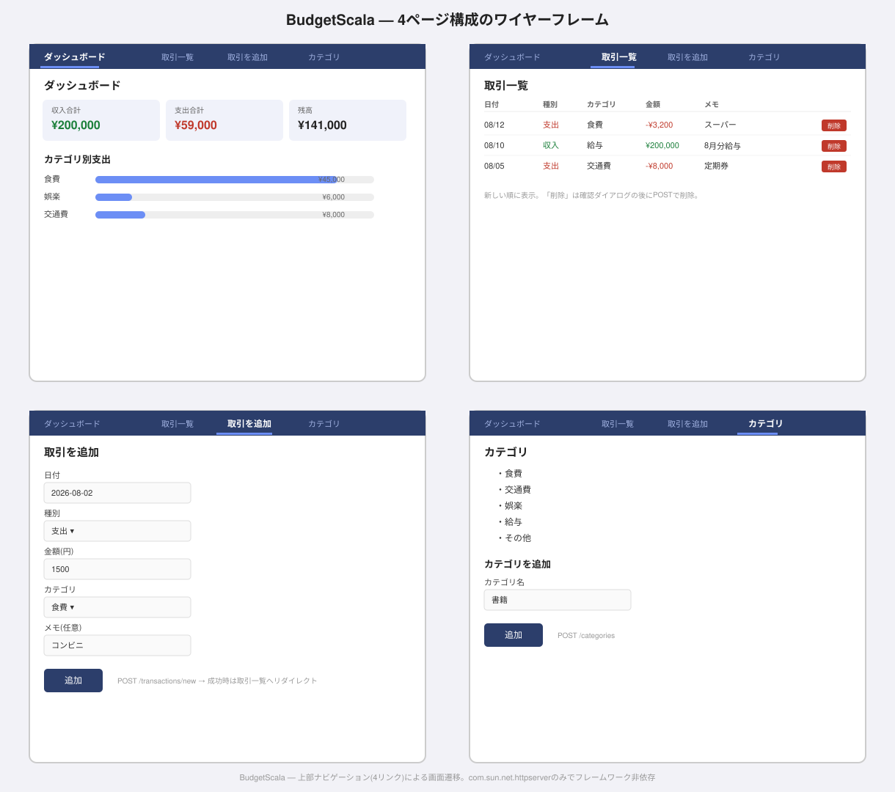
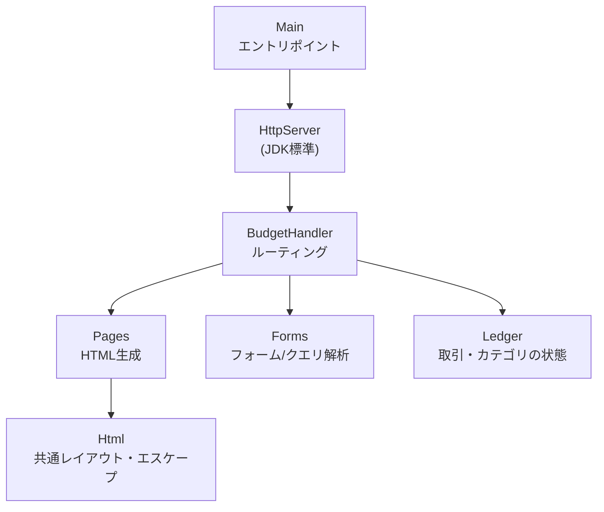
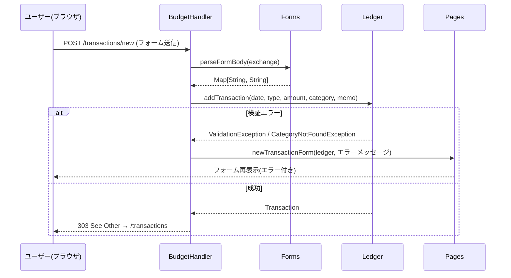
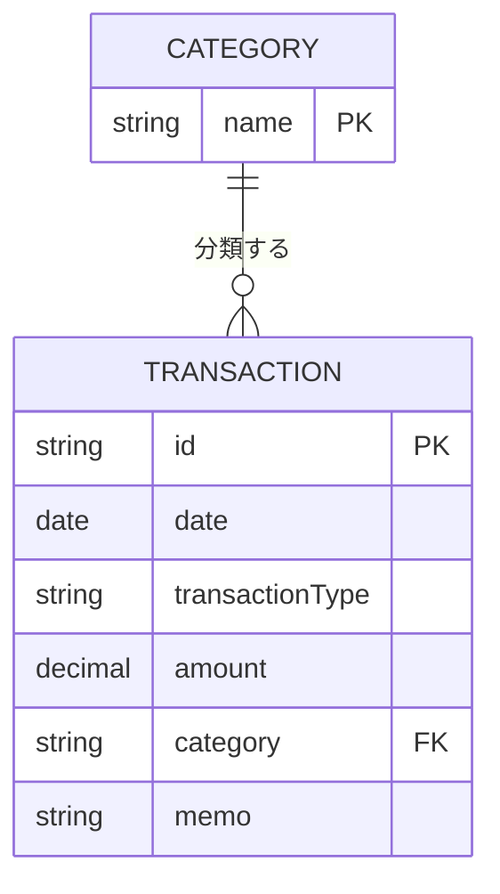

# BudgetScala 💰

Scalaで動く、個人向け家計簿Webアプリ。「15の言語で15個のアプリを作る」ポートフォリオプロジェクトの13本目（Scala編）。


## 目次

* [概要](#概要)
* [特徴（主な機能）](#特徴主な機能)
* [想定ユーザー（ペルソナ）](#想定ユーザーペルソナ)
* [UIイメージ](#uiイメージ)
* [技術スタック](#技術スタック)
* [システム構成図](#システム構成図)
* [データ構造](#データ構造)
* [セットアップ](#セットアップ)
* [エンドポイント一覧](#エンドポイント一覧)
* [今後の展望](#今後の展望)

## 概要

BudgetScalaは、収入・支出を記録して家計を可視化するWebアプリです。これまでのCLIツール群と異なり、ブラウザ上でダッシュボード・取引一覧・取引追加フォーム・カテゴリ管理の4ページを行き来する構成になっています。

Play FrameworkやAkka HTTPのような外部Webフレームワークは使わず、JDK標準の`com.sun.net.httpserver.HttpServer`だけでルーティング・フォーム処理・HTML生成をすべて自前実装しています。ビルドもsbtを使わず、`scalac`での直接コンパイルです（Kotlin編のNoteKtで`kotlinc`を直接使ったのと同じ考え方です）。テストも外部フレームワーク（ScalaTestやMUnit）を使わず、自作のテストハーネスで書いています。

## 特徴（主な機能）

- 収入・支出の記録（日付・種別・金額・カテゴリ・メモ）
- 取引の削除
- カテゴリの追加（初期カテゴリ: 食費・交通費・娯楽・給与・その他）
- ダッシュボードでの収入合計・支出合計・残高の表示
- カテゴリ別支出の内訳をバーで可視化
- 4ページ（ダッシュボード／取引一覧／取引を追加／カテゴリ）を上部ナビゲーションで行き来する画面遷移

## 想定ユーザー（ペルソナ）

家計簿アプリを使うほどではないけれど、月々のおおまかな収支とカテゴリ別の使いすぎを把握したい一人暮らしの学生・社会人を想定しています。銀行口座連携や自動仕訳、レシートのOCR読み取りのような高度な家計簿SaaSの機能は対象外で、あくまで手入力ベースの軽量な収支記録ツールという位置づけです。

## UIイメージ



ダッシュボード／取引一覧／取引を追加／カテゴリ、という4ページの構成を示したワイヤーフレームです。実際のアプリでも、上部のナビゲーションバーからこの4ページ全てに行き来できます。

## 技術スタック

| 分類 | 技術 |
| --- | --- |
| 言語 | Scala 3.x |
| 実行環境 | JVM（JDK 17以上） |
| HTTPサーバー | JDK標準の`com.sun.net.httpserver.HttpServer`（外部Webフレームワーク不使用） |
| ビルド | `scalac`直接コンパイル（sbt不使用） |
| テスト | 自作テストハーネス（`test/budgetscala/test/TestHarness.scala`） |
| CI/CD | GitHub Actions（`coursier/setup-action`でScala本体をセットアップ） |

## システム構成図





## データ構造

すべてのデータは`Ledger`がメモリ上に保持します（永続化なし。実運用ならSQLiteやファイル保存が必要です）。

**Transaction**

| フィールド | 型 | 説明 |
| --- | --- | --- |
| `id` | String | 例: `tx-1` |
| `date` | LocalDate | 取引日 |
| `transactionType` | Income \| Expense | 収入か支出か |
| `amount` | BigDecimal | 金額（常に正の値。`Double`ではなく`BigDecimal`を使うことで丸め誤差を避けています） |
| `category` | String | カテゴリ名 |
| `memo` | String | メモ（任意） |

**Category**

カテゴリは`Ledger`内で単純な`List[String]`として管理し、重複と空文字を`addCategory`で拒否します。初期カテゴリは「食費・交通費・娯楽・給与・その他」の5つです。

**ER図**



概念的にはCATEGORYを親、TRANSACTIONを子とする1対多の関係で、TRANSACTION側の`category`がCATEGORYの`name`を参照するFKにあたります。ただし現状はメモリ上の`List[String]`と`addTransaction`時の存在チェックでこれを表現しているだけで、実際のリレーショナルDBのFK制約ではありません。永続化する場合はSQLiteの`categories`テーブル＋外部キー制約に置き換えるのが自然です（[今後の展望](#今後の展望)を参照）。

## セットアップ

Scala 3.x（JDK 17以上）が必要です。sbtは不要です。

```bash
# Scalaのバージョン確認
scala -version

# コンパイル(出力先ディレクトリは事前に作成しておく必要があります)
mkdir -p build
scalac -d build $(find src test -name "*.scala")

# テスト実行(新しいScalaランナーではメインクラス指定に -M を使います)
scala -cp build -M budgetscala.test.TestRunner

# アプリの起動(デフォルトはポート8080)
scala -cp build -M budgetscala.Main
```

起動後、ブラウザで `http://localhost:8080/` を開いてください。起動時にサンプルの取引がいくつか登録された状態で始まります。

ポートを変更したい場合は引数で指定できます。

```bash
scala -cp build -M budgetscala.Main -- 9090
```

> Windows PowerShellの場合、`$(find ...)`は使えないため、代わりに次のようにしてください。
>
> ```powershell
> mkdir build
> $files = Get-ChildItem -Recurse -Include *.scala | ForEach-Object { $_.FullName }
> scalac -d build @files
> scala -cp build -M budgetscala.test.TestRunner
> scala -cp build -M budgetscala.Main
> ```

## エンドポイント一覧

| メソッド | パス | 説明 |
| --- | --- | --- |
| GET | `/` | ダッシュボード |
| GET | `/transactions` | 取引一覧 |
| GET | `/transactions/new` | 取引追加フォーム |
| POST | `/transactions/new` | 取引を作成し`/transactions`へリダイレクト |
| POST | `/transactions/{id}/delete` | 指定した取引を削除 |
| GET | `/categories` | カテゴリ一覧・追加フォーム |
| POST | `/categories` | カテゴリを作成し`/categories`へリダイレクト |

バリデーションエラー（金額が0以下、未知のカテゴリ、カテゴリ名の重複など）は`400`でフォーム画面を再表示し、エラーメッセージを表示します。

## 今後の展望

- SQLiteやファイルによる永続化
- 月別・期間指定でのフィルタリング
- 取引の編集機能（現在は削除のみ）
- カテゴリごとの予算上限設定とアラート
- CSVエクスポート

あくまで学習・ポートフォリオ用途の家計簿アプリという位置づけで、銀行API連携や複数通貨対応のような本格的な家計簿サービスの機能は対象外です。
